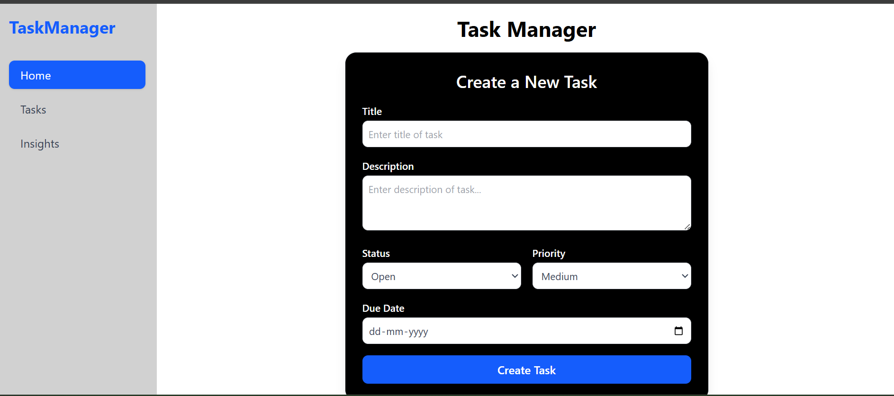
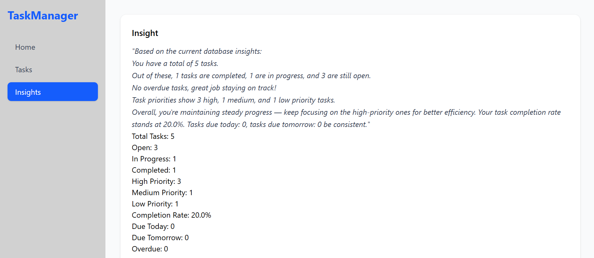
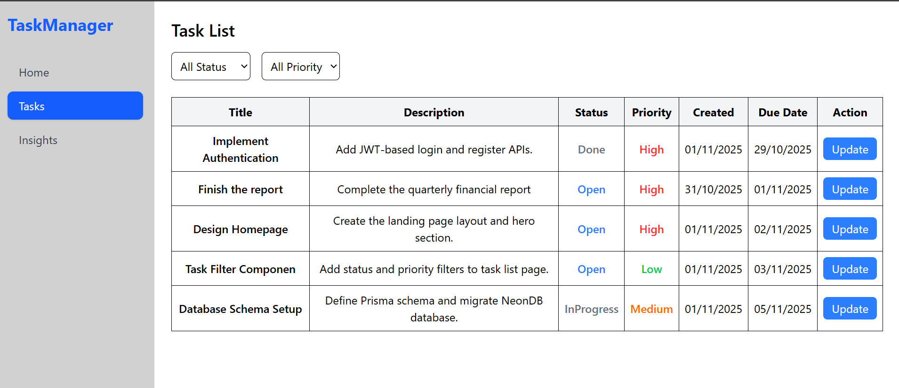

# Task Manager Application

A full-stack task management application built with React and Node.js.

# Task Manager Application

A full-stack task management application built with React and Node.js.

## Screenshots

### Task List View

*Main dashboard showing all tasks with filtering options*

### Create Task

*Form for creating new tasks*

### Task Insights

*Analytics dashboard showing task statistics*

### Task List 
* List view of tasks*

## Project Structure

```
task-manager/
├── frontend/                 # React frontend
│   ├── src/
│   │   ├── components/      # Reusable components
│   │   ├── tabs/           # Main application views
│   │   └── apiservices.js  # API integration
│   └── vite.config.js      # Vite configuration
└── backend/                 # Node.js backend
    ├── prisma/             # Database schema and migrations
    ├── server.js           # Express server
    └── .env               # Environment variables
```

## Features

- Create, read, and update tasks
- Filter tasks by status and priority
- Task insights and analytics
- Real-time task statistics
- Priority-based task management
- Due date tracking

## Technology Stack

### Frontend
- React
- Vite
- CSS for styling
- Axios for API calls

### Backend
- Node.js
- Express
- Prisma ORM
- MySQL/PostgreSQL

## Getting Started

### Prerequisites
- Node.js (v16 or higher)
- npm or yarn
- Database (MySQL/PostgreSQL)

### Installation

1. Clone the repository:
```bash
git clone [your-repository-url]
```

2. Backend Setup:
```bash
cd backend
npm install
npx prisma migrate dev
npm run dev
```

3. Frontend Setup:
```bash
cd frontend
npm install
npm run dev
```

### Environment Variables

Create a `.env` file in the backend directory:
```env
DATABASE_URL="your-database-url"
PORT=3000
```

## API Endpoints

- `POST /tasks` - Create a new task
- `GET /tasks` - Get all tasks (with optional filters)
- `PUT /tasks/:id` - Update task status/priority
- `GET /tasks/insights` - Get task analytics

## Contributing

1. Fork the repository
2. Create your feature branch
3. Commit your changes
4. Push to the branch
5. Create a new Pull Request

## License
This project is licensed under the MIT License - see the LICENSE file for details.